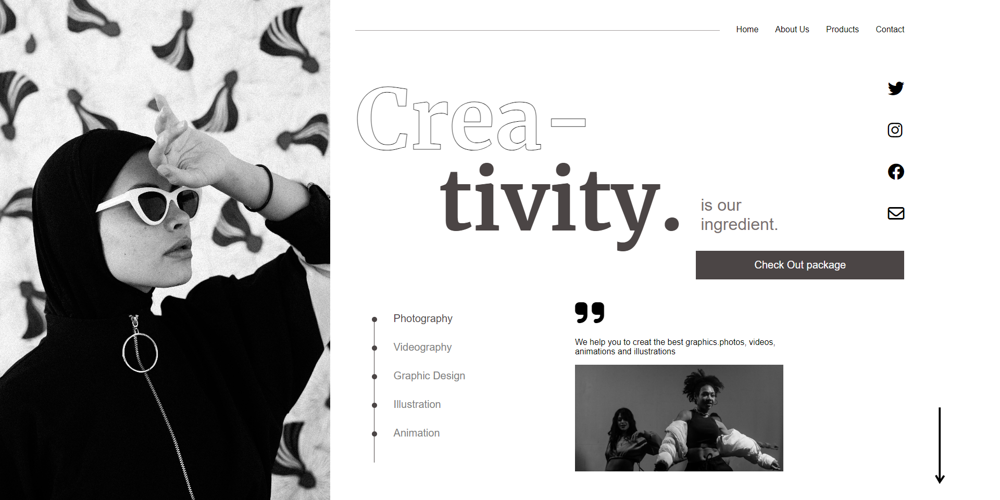

# HTML  and CSS 

# Project 14 - Creativity Landing Web 

By Maulik Vadodariya

## [Link to the live Project](https://creativity-landing-web.netlify.app/)

## What I learned from this Project?

- I have done this project using `HTML` and `CSS` only.
- Responsive Design.

## I spent 4 to 5 hours in making this project

